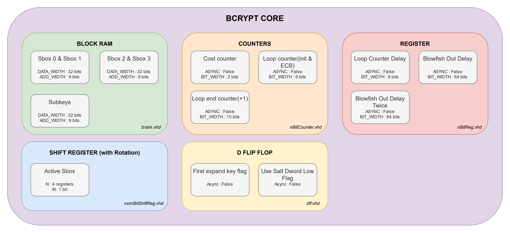

# FPGA BRUTEFORCE ATTACK

## Docs
### Articles
Bcrypt :
- https://hackaday.com/2020/05/15/all-your-passwords-are-belong-to-fpga/
- https://ieeexplore.ieee.org/document/7032529

HLS :
- https://arodes.hes-so.ch/record/11719

### Docs
Bcrypt :
- https://en.wikipedia.org/wiki/Bcrypt
- ??

Blowfish :
- https://en.wikipedia.org/wiki/Blowfish_(cipher)
- https://www.geeksforgeeks.org/blowfish-algorithm-with-examples/

### Other

VHDL code :
- https://github.com/rub-hgi/high-speed_bcrypt

## Bcrypt Core



Single core clock cycle for a cost of 4 : 331529 

For 1 Sbox memory needed : 8192 bits = 8kb

4 sbox : 8kb * 4 = 32kb

For Subkey memory needed : 576 bits

Frequency = 100 MHz

Hashrate = 301.6 hash/s

## Bcrypt Core on a Zedboard

LUT used : 879 / 53'200 = 1.65%

Flip-Flop used : 311 / 106'400 = 0.29%

Bram used : 3 / 140 = 2.14%

## Bcrypt Core on a Nexys Video

LUT used : 879 / 134'600 = 0.65%

Flip-Flop used : 311 / 269'200 = 0.12%

Bram used : 3 / 365 = 0.82%

## Bcrypt algorithm

Pseudo-code example :

```js
Function bcrypt
   Input:
      cost:     Number (4..31)                      log2(Iterations). e.g. 12 ==> 212 = 4,096 iterations
      salt:     array of Bytes (16 bytes)           random salt
      password: array of Bytes (1..72 bytes)        UTF-8 encoded password
   Output: 
      hash:     array of Bytes (24 bytes)

   //Initialize Blowfish state with expensive key setup algorithm
   //P: array of 18 subkeys (UInt32[18])
   //S: Four substitution boxes (S-boxes), S0...S3. Each S-box is 1,024 bytes (UInt32[256])
   P, S ← EksBlowfishSetup(password, salt, cost)   

   //Repeatedly encrypt the text "OrpheanBeholderScryDoubt" 64 times
   ctext ← "OrpheanBeholderScryDoubt"  //24 bytes ==> three 64-bit blocks
   repeat (64)
      ctext ← EncryptECB(P, S, ctext) //encrypt using standard Blowfish in ECB mode

   //24-byte ctext is resulting password hash
   return Concatenate(cost, salt, ctext)
```
