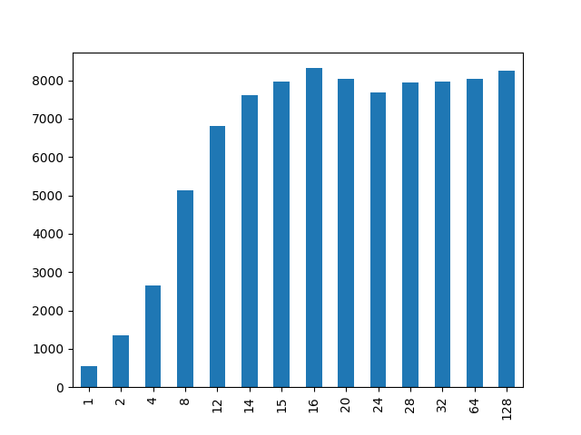
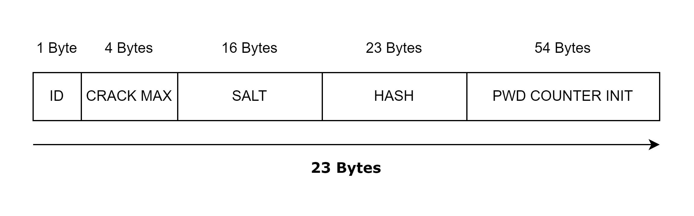
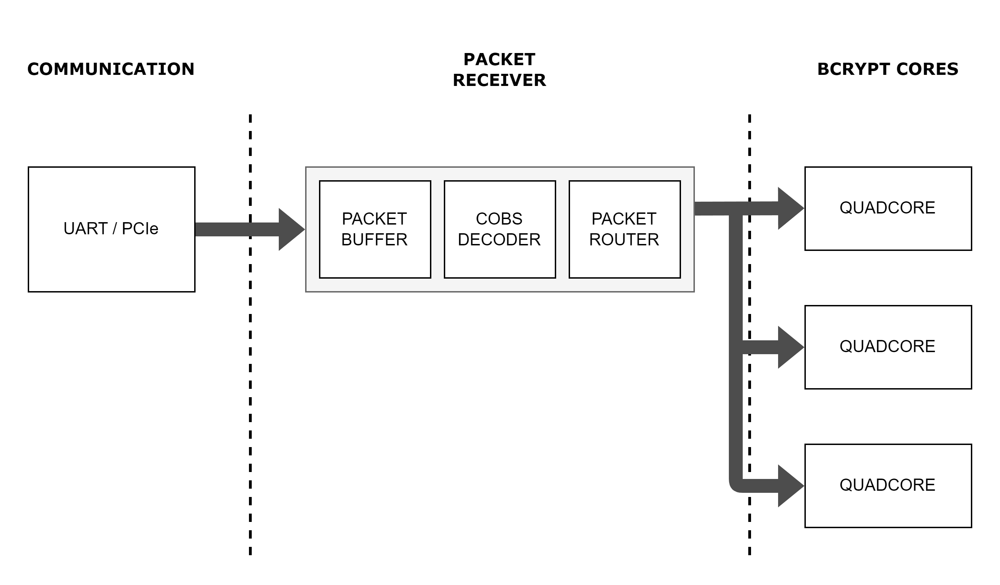

# Journal - Projet Bachelor

# Semaine 1 - (13.05.2024 - 17.05.2024)

Le but de cette semaine est de mesurer les performances actuelles du bcrypt cracker sur les différents cartes FPGA.

## Simulation

Pour un cost de **5**, un Bcrypt core prend **649'225** coups d'horloge.

## Nexys Video

La Nexys Video semble marcher seulement à **100 MHz**.

J'ai réussi à instancier jusqu'à **22** Quadcores, c'est à dire **88** Bcrypt Core.
Donc, on a un hashrate de 13'554 Hash/s.

Il n'est pas possible d'instancier plus, non pas à cause d'un manque de ressources mais à cause des contraintes de timing.

## Kintex Ultrascale+

| Freq (MHz) 	| WNS (1 Quadcore) 	| Quadcores Max. 	| Utilisations (%)         	| WNS   	| Hashrate (cost : 5) 	|
|------------	|------------------	|----------------	|--------------------------	|-------	|---------------------	|
| 100        	| 5.698            	| 36             	| BRAM : 97.50, LUT : 68   	| 0.988 	| 22'180 H/s          	|
| 200        	| 1.237            	| 36             	| BRAM : 97.50, LUT : 68   	| 0.388 	| 44'369 H/s          	|
| 250        	| 0.43             	| 36            	| BRAM : 97.50, LUT : 68    | 0.115    	| 55'450 H/s          	|
| 275        	| 0.294            	| < 30            	| -                        	| -     	| < 50'820 H/s          |
| 300        	| 0.082            	| 5              	| BRAM : 13.54, LUT : 7.87 	| 0.007 	| 9241 H/s            	|
| 325        	| -0.153           	| 0              	| 0                        	| X     	| -                   	|

On peut voir déjà que à la même fréquence que la Nexys Video, on est plus vraiment limité par les contraintes de timings mais par les ressources. On arrive donc à instancier **14** Quadcores en plus.

Le résultat le plus surprenant, c'est à quelle point le système semble marcher à 200 MHz.

## Notes perso

La mise en place d'une pipeline pour la partie Blowfish devrait non seulement permettre de monter encore plus la fréquence du système mais devrait aussi permettre d'instancier plus de Bcrypt core.

# Semaine 2 - (21.05.2024 - 24.05.2024)

Cette semaine je vais devoir mesurer les performances du Bcrypt sur un CPU et si possible de mesurer sur GPU aussi, afin des références pour les futurs optimisations.

## Programme C - Single Threaded

J'ai fait un premier programme C, juste pour tester la fonction bcrypt provenant de la libraire crypt (Librairie POSIX).

Dans ce programme j'ai lancé la fonction de hash avec un cost de 5, 10'000 fois, afin d'avoir une moyenne du temps pris par le CPU.

Résultat :
```Bash
Salt: $2b$05$dnQY/8g/fqXHs8qIjyBD2.
Time measured: 18.707516 seconds.
Hash time : 0.001871 seconds.
Hash per second: 534.544511
```

## RDV

Liste des sujets :
- [x] Chercher la fréquence la plus élévée avec le plus de quadcore ([voir tableau](#kintex-ultrascale))
- [ ] Faire des recherches sur l'utilisation des macros pour le routage (pour définir des blocs)
- [x] Vérifier que le design ne soit pas optimisé dû au hash qui a été hardcodé
- [x] Faire des mesures pour le code C
- [ ] Mettre en place une communication UART pour initialiser les quadcores
- [ ] Mettre en place un protocole de communication avec de la synchronisation et gestion d'erreur pour l'UART

## Programme C - Multi Threaded

J'ai ensuite fait un programme avec des threads afin de utiliser un maximum les différents coeurs de mon processeur.

Dans mon cas, j'ai un **AMD Ryzen 7 4800U** avec **8 Cores** et **2 Threads par core**.

J'ai ainsi fait des mesures ou j'ai executé mon programme qui fait le hash 10'000 fois pour différents nombres de threads.



Dans ce graphique, on peut voir les différents hashrate déduit de mon programme par rapport au nombre de threads instanciés. Le Hashrate le plus élevé est celui avec 16 threads, cela coincide avec les spécifications de mon processeur.

## Verification optimisation design

Afin de vérifier que le design n'est pas optimisé, j'ai décidé de remplacer le hash en constante par une entrée.

J'ai lancé une synthèse avec 36 Quadcores, qui est le maximum possible sur la Kyntex est le nombre de LUT utilisés a augmenté de 15%.

Maintenant que je sais que une optimisation a bien lieu, je dois refaire l'implémentation afin de vérifier que les résultats précedents sont toujours valables.

Pour ce faire, j'ai changé de méthode pour pouvoir faire l'implémentation. J'ai trouvé un exemple qui utilise les attributs afin d'empecher l'optimisation sur les signaux.

## Communication UART

Afin de pouvoir interfacer les différents quadcores, je dois mettre en place pour l'instant une communication UART. Ainsi je vais pouvoir initialiser les compteurs de mots de passes des différents Quadcores. 

L'idée serait de bien séparé la couche communication UART du reste, afin de pouvoir plus tard remplacé plus facilement l'UART par le PCIe. 

Afin d'avoir une communication solide, il me faut un protocole simple m'assurant que le paquet recu soit bien synchronisé.
Pour ce faire, j'ai décidé d'encoder mes paquets avec l'algorithme COBS.

Au final, je vais avoir un système de paquets, contenant un byte de start(le byte va contenir l'offset du prochain 0x00), la longueur du payload, le payload, le CRC du payload et un byte de fin (0x00).



Pour l'UART, je vais pouvoir mettre dans le payload toutes les informations nécessaires à l'initialisation d'un Quadcore. C'est à dire l'ID du Quadcore, le nombre d'essais, le salt et le hash que l'on souhaite casser et l'init du compteur de mots de passe. 



Pendant la récéption du paquet, je vais pouvoir décoder le paquet et stocker le résultat dans un buffer pour le routeur. En parralèle du décodage, le CRC va pouvoir être calculé.

Si le CRC check est bon, le routeur va pouvoir distribuer les informations en fonction du paquet recu.

# Semaine 3 - (27.05.2024 - 31.05.2024)

Cette semaine je dois mettre en place la communication UART avec un système de paquet. Le programme doit être fait de manière modulable afin de pouvoir aisemment remplacer l'UART par le PCIe.

## Packet receiver

J'ai pu commencer par le module packet receiver, qui va s'occuper de recevoir les données de l'UART et décoder le paquet à chaque byte recu. Le calcul du crc sera fait à chaque byte décodé. A la fin à l'aide de la longueur du payload recu, j'ai pu vérifier le crc.

J'ai validé le fonctionnement de ce module à l'aide d'un testbentch qui a envoyé deux paquets différents et vérifier que les paquets recus ont bien été décodé et le crc bien vérifié.

J'ai pu aussi valider le bon fonctionnement du module avec un deuxième testbench qui va cette fois ci communiquer avec un module uart. 

## RDV

Liste des sujets :

- [ ] Finir la partie emission de paquets et tester avec des LEDs
- [ ] Mettre en place un système de retour de paquets par couche (transfert et applicatifs)
- [ ] Commencer à étudier en parralèle pour le PCIe.

## Data router

Maintenant que le packet receiver est fonctionnel, je peux entamer le design du Data router.

Le router va bufferisé les données recus, jusqu'à recevoir une confirmation du receiver lorsque le paquet entier a été envoyé et vérifié. Suite à la confirmation, le router va pouvoir entamé l'envoi des données au quadcore ciblé.

Ce module au contraire du packet receiver va avoir une execution spécifique pour l'UART. C'est à dire que ce module et le module quadcore vont avoir une interface particulière qui ne sera plus le même pour le PCIe.

Il va falloir aussi modifier le bcrypt quadcore. Il va falloir notamment adapter son interface. 

**Les modifications à faire sur le Quadcore :**
- [x] Changer le number of cracks de generic à port d'entrée
- [x] Ajouter deux ports pour initialiser le générateur de mot de passe (vec_init et vec_length)
- [x] Ajouter une mémorisation de ces différents ports d'interface, car l'état des ports risque de changer pendant les calculs.
- [x] Modifier la machine d'état afin d'y ajouter un état d'initialisation
- [x] Modifier le générateur de mots passe afin de changer les génériques en ports d'entrée
- [ ] Tester à l'aide d'un testbench le bon fonctionnement du nouveau bcrypt quadcore