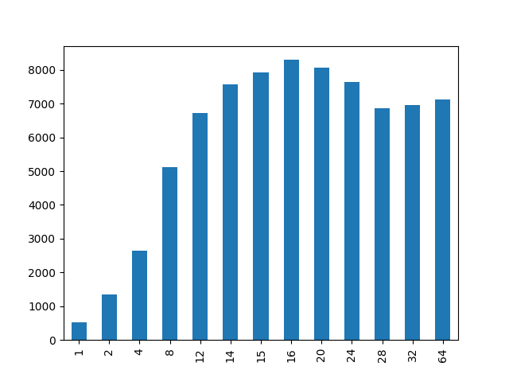
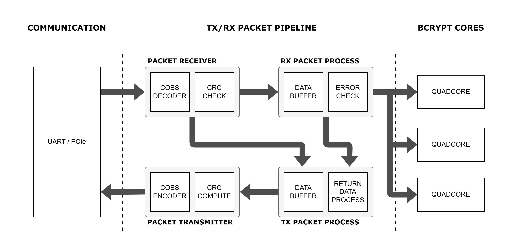
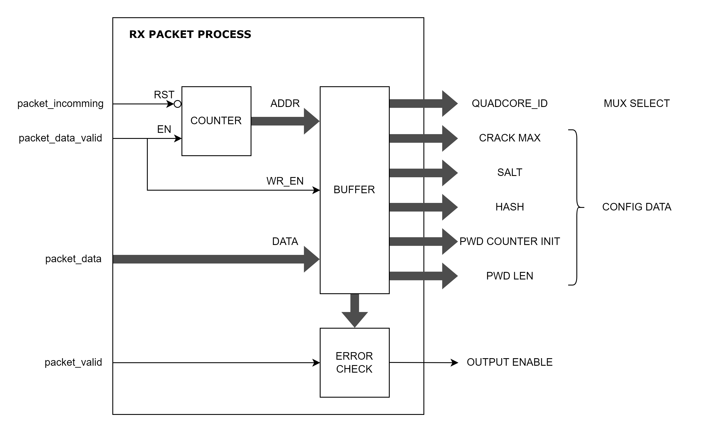

# Journal - Projet Bachelor

# Semaine 1 - (13.05.2024 - 17.05.2024)

Le but de cette semaine est de mesurer les performances actuelles du bcrypt cracker sur les différents cartes FPGA.

## Simulation

Pour un cost de **5**, un Bcrypt core prend **649'225** coups d'horloge.

## Nexys Video

La Nexys Video semble marcher seulement à **100 MHz**.

J'ai réussi à instancier jusqu'à **22** Quadcores, c'est à dire **88** Bcrypt Core.
Donc, on a un hashrate de 13'554 Hash/s.

Il n'est pas possible d'instancier plus, non pas à cause d'un manque de ressources mais à cause des contraintes de timing.

## Kintex Ultrascale+

| Freq (MHz) 	| WNS (1 Quadcore) 	| Quadcores Max. 	| Utilisations (%)         	| WNS   	| Hashrate (cost : 5) 	|
|------------	|------------------	|----------------	|--------------------------	|-------	|---------------------	|
| 100        	| 5.698            	| 36             	| BRAM : 97.50, LUT : 68   	| 0.988 	| 22'180 H/s          	|
| 200        	| 1.237            	| 36             	| BRAM : 97.50, LUT : 68   	| 0.388 	| 44'369 H/s          	|
| 250        	| 0.43             	| 36            	| BRAM : 97.50, LUT : 68    | 0.115    	| 55'450 H/s          	|
| 275        	| 0.294            	| < 30            	| -                        	| -     	| < 50'820 H/s          |
| 300        	| 0.082            	| 5              	| BRAM : 13.54, LUT : 7.87 	| 0.007 	| 9241 H/s            	|
| 325        	| -0.153           	| 0              	| 0                        	| X     	| -                   	|

On peut voir déjà que à la même fréquence que la Nexys Video, on est plus vraiment limité par les contraintes de timings mais par les ressources. On arrive donc à instancier **14** Quadcores en plus.

Le résultat le plus surprenant, c'est à quelle point le système semble marcher à 200 MHz.

## Notes perso

La mise en place d'une pipeline pour la partie Blowfish devrait non seulement permettre de monter encore plus la fréquence du système mais devrait aussi permettre d'instancier plus de Bcrypt core.

# Semaine 2 - (21.05.2024 - 24.05.2024)

Cette semaine je vais devoir mesurer les performances du Bcrypt sur un CPU et si possible de mesurer sur GPU aussi, afin des références pour les futurs optimisations.

## Programme C - Single Threaded

J'ai fait un premier programme C, juste pour tester la fonction bcrypt provenant de la libraire crypt (Librairie POSIX).

Dans ce programme j'ai lancé la fonction de hash avec un cost de 5, 10'000 fois, afin d'avoir une moyenne du temps pris par le CPU.

Résultat :
```Bash
Salt: $2b$05$dnQY/8g/fqXHs8qIjyBD2.
Time measured: 18.707516 seconds.
Hash time : 0.001871 seconds.
Hash per second: 534.544511
```

## RDV

Liste des sujets :
- [x] Chercher la fréquence la plus élévée avec le plus de quadcore ([voir tableau](#kintex-ultrascale))
- [ ] Faire des recherches sur l'utilisation des macros pour le routage (pour définir des blocs)
- [x] Vérifier que le design ne soit pas optimisé dû au hash qui a été hardcodé
- [x] Faire des mesures pour le code C
- [ ] Mettre en place une communication UART pour initialiser les quadcores
- [x] Mettre en place un protocole de communication avec de la synchronisation et gestion d'erreur pour l'UART

## Programme C - Multi Threaded

J'ai ensuite fait un programme avec des threads afin de utiliser un maximum les différents coeurs de mon processeur.

Dans mon cas, j'ai un **AMD Ryzen 7 4800U** avec **8 Cores** et **2 Threads par core**.

J'ai ainsi fait des mesures ou j'ai executé mon programme qui fait le hash 10'000 fois pour différents nombres de threads.



Dans ce graphique, on peut voir les différents hashrate déduit de mon programme par rapport au nombre de threads instanciés. Le Hashrate le plus élevé est celui avec 16 threads, cela coincide avec les spécifications de mon processeur.

## Verification optimisation design

Afin de vérifier que le design n'est pas optimisé, j'ai décidé de remplacer le hash en constante par une entrée.

J'ai lancé une synthèse avec 36 Quadcores, qui est le maximum possible sur la Kyntex est le nombre de LUT utilisés a augmenté de 15%.

Maintenant que je sais que une optimisation a bien lieu, je dois refaire l'implémentation afin de vérifier que les résultats précedents sont toujours valables.

Pour ce faire, j'ai changé de méthode pour pouvoir faire l'implémentation. J'ai trouvé un exemple qui utilise les attributs afin d'empecher l'optimisation sur les signaux.

## Communication UART

Afin de pouvoir interfacer les différents quadcores, je dois mettre en place pour l'instant une communication UART. Ainsi je vais pouvoir initialiser les compteurs de mots de passes des différents Quadcores. 

L'idée serait de bien séparé la couche communication UART du reste, afin de pouvoir plus tard remplacé plus facilement l'UART par le PCIe. 

Afin d'avoir une communication solide, il me faut un protocole simple m'assurant que le paquet recu soit bien synchronisé.
Pour ce faire, j'ai décidé d'encoder mes paquets avec l'algorithme COBS.

Au final, je vais avoir un système de paquets, contenant un byte de start(le byte va contenir l'offset du prochain 0x00), la longueur du payload, le payload, le CRC du payload et un byte de fin (0x00).


Pour l'UART, je vais pouvoir mettre dans le payload toutes les informations nécessaires à l'initialisation d'un Quadcore. C'est à dire l'ID du Quadcore, le nombre d'essais, le salt et le hash que l'on souhaite casser et l'init du compteur de mots de passe. 


Pendant la récéption du paquet, je vais pouvoir décoder le paquet et stocker le résultat dans un buffer. En parralèle du décodage, le CRC va pouvoir être calculé.

Si le CRC check est bon, le buffer va pouvoir envoyer les données en fonction du paquet recu.

# Semaine 3 - (27.05.2024 - 31.05.2024)

Cette semaine je dois mettre en place la communication UART avec un système de paquet. Le programme doit être fait de manière modulable afin de pouvoir aisemment remplacer l'UART par le PCIe.

## Packet receiver

J'ai pu commencer par le module packet receiver, qui va s'occuper de recevoir les données de l'UART et décoder le paquet à chaque byte recu. Le calcul du crc sera fait à chaque byte décodé. A la fin à l'aide de la longueur du payload recu, j'ai pu vérifier le crc.

J'ai validé le fonctionnement de ce module à l'aide d'un testbentch qui a envoyé deux paquets différents et vérifier que les paquets recus ont bien été décodé et le crc bien vérifié.

J'ai pu aussi valider le bon fonctionnement du module avec un deuxième testbench qui va cette fois ci communiquer avec un module uart. 

## RDV

Liste des sujets :

- [x] Finir la partie emission de paquets et tester avec des LEDs
- [ ] Mettre en place un système de retour de paquets par couche (transfert et applicatifs)
- [ ] Commencer à étudier en parralèle pour le PCIe.

## Data router

Maintenant que le packet receiver est fonctionnel, je peux entamer le design du Data buffer.

Ce module va bufferisé les données recus, jusqu'à recevoir une confirmation du receiver lorsque le paquet entier a été envoyé et vérifié. Suite à la confirmation, le buffer va pouvoir entamé l'envoi des données au quadcore ciblé.

Ce module au contraire du packet receiver va avoir une execution spécifique pour l'UART. C'est à dire que ce module et le module quadcore vont avoir une interface particulière qui ne sera plus le même pour le PCIe.

Il va falloir aussi modifier le bcrypt quadcore. Il va falloir notamment adapter son interface. 

**Les modifications à faire sur le Quadcore :**
- [x] Changer le number of cracks de generic à port d'entrée
- [x] Ajouter deux ports pour initialiser le générateur de mot de passe (vec_init et vec_length)
- [x] Ajouter une mémorisation de ces différents ports d'interface, car l'état des ports risque de changer pendant les calculs.
- [x] Modifier la machine d'état afin d'y ajouter un état d'initialisation
- [x] Modifier le générateur de mots passe afin de changer les génériques en ports d'entrée
- [x] Tester à l'aide d'un testbench le bon fonctionnement du nouveau bcrypt quadcore

## Benchmark GPU

Afin d'avoir une référence de vitesse de hash pour notre FPGA, j'ai utilisé Hashcat afin de trouver le hashrate de mon GPU.

En effet, on peut utiliser hashcat afin de faire un benchmark de notre GPU pour le type de Hash souhaité.
Dans mon cas, j'ai utilisé le GPU de chez moi, un **GTX 1660 Super**.

Benchmark GPU:
```Bash
.\hashcat.exe -m 3200 --benchmark
hashcat (v6.2.6) starting in benchmark mode

Benchmarking uses hand-optimized kernel code by default.
You can use it in your cracking session by setting the -O option.
Note: Using optimized kernel code limits the maximum supported password length.
To disable the optimized kernel code in benchmark mode, use the -w option.

CUDA API (CUDA 12.4)
====================
* Device #1: NVIDIA GeForce GTX 1660 SUPER, 5134/6143 MB, 22MCU

OpenCL API (OpenCL 3.0 CUDA 12.4.131) - Platform #1 [NVIDIA Corporation]
========================================================================
* Device #2: NVIDIA GeForce GTX 1660 SUPER, skipped

Benchmark relevant options:
===========================
* --optimized-kernel-enable

----------------------------------------------------------------
* Hash-Mode 3200 (bcrypt $2*$, Blowfish (Unix)) [Iterations: 32]
----------------------------------------------------------------

Speed.#1.........:    19201 H/s (66.78ms) @ Accel:4 Loops:32 Thr:16 Vec:1

Started: Fri May 31 18:11:39 2024
Stopped: Fri May 31 18:11:47 2024
```

Le benchmark de Hashcat nous a donné un hashrate de **19201 Hash/s**, pour 32 itérations de boucle (cost = 5, 2**5 = 32).
Le benchmark a été donc fait sur un cost de 5, on peut vérifier cela :
```Bash
.\hashcat.exe -m 3200 --example-hashes
hashcat (v6.2.6) starting in hash-info mode

Hash Info:
==========

Hash mode #3200
  Name................: bcrypt $2*$, Blowfish (Unix)
  Category............: Operating System
  Slow.Hash...........: Yes
  Password.Len.Min....: 0
  Password.Len.Max....: 72
  Salt.Type...........: Embedded
  Salt.Len.Min........: 0
  Salt.Len.Max........: 256
  Kernel.Type(s)......: pure
  Example.Hash.Format.: plain
  Example.Hash........: $2a$05$MBCzKhG1KhezLh.0LRa0Kuw12nLJtpHy6DIaU.JAnqJUDYspHC.Ou
  Example.Pass........: hashcat
  Benchmark.Mask......: ?b?b?b?b?b?b?b
  Autodetect.Enabled..: Yes
  Self.Test.Enabled...: Yes
  Potfile.Enabled.....: Yes
  Custom.Plugin.......: No
  Plaintext.Encoding..: ASCII, HEX
```

Le hash d'exemple a bien un cost de 5.

# Semaine 4 - (03.06.2024 - 07.06.2024)

## RDV

Liste des sujets :

- [x] Tester le packet receiver sur l'Hardware
- [ ] Déjà commencer le feedback des paquets (avec système de couches)
- On a discuté de la possibilité d'utiliser L'ethernet pour maximiser la scalabilité. On a envisagé l'utilisation de Zinq avec un Petalinux et des cartes SCALP qui sont des cartes scalables en 3D : https://www.linkedin.com/pulse/scalp-self-configurable-3-d-cellular-multi-fpga-adaptive-upegui/

## Bcrypt quadcore

Le bcrypt quadcore a été modifié de manière à pouvoir le rendre reconfigurable. Le module a été testé à l'aide d'un testbench.

## Système de retour de paquets

Pour le système de retour de paquets, il va falloir séparer le système en 2 couches. On a une première couche qui est le décodage et le calcul de CRC, quand le CRC est faux il faut renvoyé un paquet à ce niveau là. On a ensuite la couche applicative, qui va permettre de confirmer que le quadcore a bien été configuré.

Pour ce faire j'ai refais le schéma général pour la communication, en y intégrant le retour.



Ce schéma n'est pas vraiment complet, il manque encore le feedback des quadcores, afin d'avoir régulièrement des paquets de status.

# Semaine 5 - (10.06.2024 - 14.06.2024)

Afin d'être sûr que le packet receiver fonctionne, je vais créer un nouveau projet afin de pouvoir le tester directement sur l'hardware (test_packet_system). Afin de tester, je vais faire un système permettant d'allumer les LEDs souhaités à partir du paquet.

## RDV

Liste des sujets :
- [] 


## Test sur HARDWARE du système de paquet

J'ai pu tester et valider le fonctionnement du système à l'aide d'un testbench et directement sur l'HARDWARE. Afin de tester sur l'hardware, j'ai fait un système permettant de controller les LED's sur la carte Nexys Video. Pour l'envoi de paquets, j'ai fait un petit scrpit python permettant la génération et l'envoi des paquets par UART.

## Configuration des Quadcores

Maintenant que je suis sûr que le receiver fonctionne, il faut que je refasse le RX packet process mais avec des sorties adaptés au Quadcores. L'idée serait aussi de potentiellement prévoir dans le design une interface supplémentaire afin de pouvoir plus tard ajouter le retour des paquets.

## RX packet process



Lorsque le paquet est validé par le receiver, un check va avoir lieu afin de vérifier si l'ID du Quadcore n'est pas trop grand ou si la longueur du message n'est pas bonne. 

## Fonctionnement global du système de paquets avec Quadcore


Le RX Packet Pipeline, contrairement au test, va avoir un logique supplémentaire qui est une vérification d'erreur dans les deux couches. Cette logique va détécter les erreurs dans chaque couche puis ressortir ces erreurs afin qu'elles puissent être utilisé par le TX Packet pipeline. Ce nouveau module va s'occuper de gérer la logique entre le renvoi de paquet et l'envoi de paquet de Status. Les paquets de status vont permettre de régulièrement envoyer un snapshot de l'état actuel des différents quadcores. Pour ce faire les différents mots de passes qui sont testés vont être bufferisé. 

## H.S (A regarder plus tard) - BRAM ET ULTRARAM 

Il se trouve que les performances qui ont été mesurés durant la première semaine sur la KCU116 sont incomplètes ([voir tableau](#kintex-ultrascale)).
En effet, les performances Max. que j'avais mesuré était à un Hashrate de **55'450 H/s** avec **36** Quadcores, à une fréquence de **250 MHz** et à une utilisation de ressources de **BRAM : 97.50%, LUT : 68%**.
D'après ces résultats, on peut constater qu'on ne peut pas instancier plus de quadcores à cause du manque de BRAM. 

Mais il se trouve que la Kyntex Ultrascale+ a une particularité supplémentaire par rapport à l'Artix 7 de la Nexys Video, La Kyntex possède à sa disposition en plus de la BRAM de l'UltraRAM. 
Un bloc d'UltraRAM possède beaucoup plus de mémoire qu'un bloc de BRAM. Il se trouve que en plus des **16.9 MB** de BRAM (480 Blocks), la Kyntex possède aussi **18 Mb** de UltraRAM (64 Blocks).

Il faudrait donc optimiser le design de manière à ce que les deux types de mémoires soit utilisés de manière balancés. 

Tout cela pourrait permettre de potentiellement ajouter beaucoup plus de Quadcores que possible actuellement.

# Semaine 6 - (17.06.2024 - 21.06.2024)

## Bcrypt Cracker

Pour l'instanciation des quadcores, j'ai repris le bcrypt cracker et j'y ai ajouté les interfaces pour les données provenant des paquets. J'ai aussi ajouté un système de MUX afin de pouvoir configurer le quadcore en fonction de l'ID recu.

Il faut encore que je refasse un testbench pour être sûr que je n'ai pas cassé le système.

## Top

Il me restera plus qu'à faire un top level qui va s'occuper d'instancier les différents modules (UART, RX PIPELINE et BCRYPT CRACKER) puis y ajouter une logique avec des LED's afin de
pouvoir observer directement sur l'HARDWARE le bon fonctionnement.

J'ai fais un nouveau schéma pour y ajouter le bcrypt cracker :


## Test

Le top level ne semble pas marcher, je vais donc faire un testbentch afin d'identifier le problème.

Le problème était l'endianess de mon paquet. J'avais formaté mon paquet en big endian, et je me suis donc retrouvé avec des configurations fausses pour mon quadcore.
Après correction du paquet, la simulation fonctionne enfin.

J'ai aussi ajouté un type d'erreur supplémentaire dans ma gestion d'erreur qui prend en compte les paquets trop petits.

## Uart Bcrypt

Le système semble fonctionnel avec un quadcore !

Autres tests à faire : 
- [x] Tester la vitesse
- [x] Tester avec plusieurs quadcores
- [x] Tester des paquets faux afin de voir si le système détécte bien les erreurs.

## Test vitesse

Afin de mesurer la vitesse, je vais tenter de cracker le mot de passe **aaaz**, en utilisant seulement un quadcore.

Un caractère a 64 possibilités, il y a là 4 caractère mais les trois premières sont la lettre **a** qui est la valeur initiale du compteur.

Donc, il est supposé tester environ : 64 + 64^2 + 64^3 + 64 soit **266368** mots de passe avant de trouver la bonne.

Pour mon premier test, j'ai que un quadcore, donc mon système à un hashrate théorique de **1208 H/s**.

Mon système va donc prendre **220s** soit **3m40s**.

Temps mesurés : **3m26s** = **206s**.

# Semaine 7 - (24.06.2024 - 28.06.2024)

## Test multiple quadcores

J'ai pu tester avec 4 quadcores dans mon système, j'ai réussi à les excecuter indépendemment.

## Test paquets faux

J'ai pu tester et valider les différents erreurs possibles à l'aide de LED's :
- Erreur de CRC 
- Paquet trop grand
- Paquet trop petit
- ID du quadcore incorrect

## Ajout d'un système de retour de paquets

Maintenant que mon système de paquets semble marcher pour notre attaque, il faudrait ajouter un système de retour qui permettra de confirmer la réception d'un paquet.

Il faudrait aussi ajouter un paquet de status qui va permettre d'indiquer l'avancement de l'attaque.

